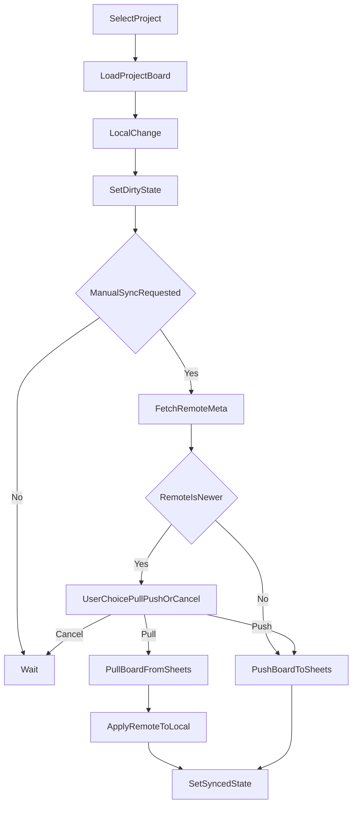

# Srello 프로젝트별 동기화 구현 계획 (실전형)

## 목표
- `Srello` 보드를 프로젝트별 `Google Sheets` 문서로 저장/불러오기.
- 1차 릴리스는 수동 동기화 우선, 자동 동기화는 2차 옵션으로 분리.
- 충돌 정책: 저장 직전 원격 `updatedAt` 확인 → 사용자 3선택(`원격 불러오기`/`로컬 덮어쓰기`/`취소`).

## 구현 범위
- Google OAuth는 기존 Calendar 방식 재사용(토큰/Client ID 저장 방식 일관 유지).
- 프로젝트마다 `Google Sheet` 1개를 연결하고, 각 시트 내 `SrelloSync` 탭에 보드 JSON 1행 저장.
- 상단 드롭다운으로 현재 프로젝트를 전환하고, 설정 모달에서 기본 프로젝트를 지정.
- 공유는 프로젝트별 시트 공유 링크로 해결(프로젝트 단위 협업/권한 분리).
- 기본 프로젝트 `Personal`을 자동 생성.
- 프로젝트 삭제는 원격 삭제 없이 `연결 해제`만 제공(사고 방지).

## 온보딩 / 초기 연결 흐름

처음 시트를 연결하는 사용자를 위한 단계별 UI 흐름을 정의한다.

### 시트 연결 방법 (2가지)
- **자동 생성**: "새 시트 만들기" 버튼 → Sheets API로 `Srello - <프로젝트명>` 시트를 자동 생성 후 연결. 사용자가 Sheets를 직접 만들 필요 없음.
- **기존 연결**: URL/ID 입력란에 Google Sheets URL 또는 ID를 붙여넣으면 자동 파싱하여 연결.
  - URL 파싱: `/spreadsheets/d/([a-zA-Z0-9-_]+)` 정규식으로 ID 추출.
  - 유효하지 않은 URL/ID 입력 시 토스트가 아닌 입력 필드 하단에 인라인 에러 표시.

### 미연결 상태(sheetId: null)에서 동기화 버튼 클릭 시
- 저장/불러오기를 실행하는 대신 **시트 연결 안내 모달** 표시.
- 안내 문구: "이 프로젝트는 아직 Google Sheets에 연결되지 않았습니다. 연결하면 다른 기기에서도 보드를 불러올 수 있습니다."
- [새 시트 만들기] / [기존 시트 연결] / [닫기] 3가지 액션 제공.

### 로컬 전용 모드
- `sheetId: null`이어도 보드는 정상 동작 (localStorage만 사용). 연결은 선택 사항.
- 동기화 배지는 `disconnected` 대신 **"로컬 전용"** 레이블로 표시하여 오류처럼 보이지 않게 한다.

## 변경 대상 파일
- [`c:/Users/admin/Desktop/Personal/Obsidian_Memo/03. Game/WebProject/js/modules/life/srello.js`](c:/Users/admin/Desktop/Personal/Obsidian_Memo/03. Game/WebProject/js/modules/life/srello.js)
  - 프로젝트별 동기화 레이어(`pullFromSheets`, `pushToSheets`, `ensureSheet`, `switchProject`) 추가
  - 프로젝트 레지스트리/기본 프로젝트/현재 프로젝트 상태 관리 추가
  - MVP: 수동 `저장/불러오기` 트리거 구현, 충돌 감지(`remoteUpdatedAt`) 및 3선택 처리
  - 동기화 상태 관리(`synced`/`dirty`/`failed`)와 재시도 훅 구현
  - Phase 2: 자동 동기화 옵션(저장/순서변경 트리거 + 디바운스) 추가 포인트 마련
- [`c:/Users/admin/Desktop/Personal/Obsidian_Memo/03. Game/WebProject/panels/life-srello.html`](c:/Users/admin/Desktop/Personal/Obsidian_Memo/03. Game/WebProject/panels/life-srello.html)
  - 상단 프로젝트 드롭다운, 시트 ID 연결, 수동 저장/불러오기 버튼, 동기화 상태 배지 추가
- [`c:/Users/admin/Desktop/Personal/Obsidian_Memo/03. Game/WebProject/js/app.js`](c:/Users/admin/Desktop/Personal/Obsidian_Memo/03. Game/WebProject/js/app.js)
  - 필요 시 전역 토스트/상태 표시 훅 연결(변경 최소화)
- [`c:/Users/admin/Desktop/Personal/Obsidian_Memo/03. Game/WebProject/docs/settings-spec.md`](c:/Users/admin/Desktop/Personal/Obsidian_Memo/03. Game/WebProject/docs/settings-spec.md)
  - 신규 localStorage 키/동기화 정책 문서화
- [`c:/Users/admin/Desktop/Personal/Obsidian_Memo/03. Game/WebProject/docs/features.md`](c:/Users/admin/Desktop/Personal/Obsidian_Memo/03. Game/WebProject/docs/features.md)
  - Srello 공유 동기화 기능 반영
- [`c:/Users/admin/Desktop/Personal/Obsidian_Memo/03. Game/WebProject/docs/planning.md`](c:/Users/admin/Desktop/Personal/Obsidian_Memo/03. Game/WebProject/docs/planning.md)
  - 구현 현황 상태 업데이트

## 동작 흐름


> **빈 시트 예외 처리**: `FetchRemoteMeta`에서 `updatedAt`이 null이면 (첫 Push 또는 빈 시트) `RemoteIsNewer` 분기를 건너뛰고 바로 `PushBoardToSheets`로 진행. 충돌 UI를 표시하지 않는다.

## 충돌 UI 명세

3선택 다이얼로그에는 사용자가 판단할 수 있는 정보를 반드시 표시한다.

### 다이얼로그 표시 항목
```
⚠️ 충돌이 감지되었습니다

  원격 (Google Sheets)          로컬 (이 브라우저)
  ─────────────────────         ──────────────────────
  수정자: <updatedBy>           수정자: <현재 계정>
  수정 시각: <원격 updatedAt>   수정 시각: <로컬 lastEditedAt>
  리스트 수: <원격 값>          리스트 수: <로컬 값>
  카드 수: <원격 값>            카드 수: <로컬 값>

  [원격으로 덮어쓰기]  [로컬로 덮어쓰기]  [취소]
```

- `updatedBy`, `updatedAt`, 리스트/카드 수를 각 버전별로 나란히 표시.
- 버튼 레이블은 "불러오기/저장" 대신 방향이 명확한 **"원격으로 덮어쓰기"** / **"로컬로 덮어쓰기"** 사용.
- 취소 시 `dirty` 상태 유지, 아무 데이터도 변경하지 않음.

### 로컬 `lastEditedAt` 필드 추가
- `srello_board_<projectId>` 저장 시 보드 루트에 `lastEditedAt: ISO string` 필드를 함께 기록.
- 충돌 UI 및 동기화 피드백에서 "마지막 로컬 수정 시각"으로 활용.

## 데이터 구조
### 프로젝트 레지스트리(localStorage)
- `srello_projects`: `[{ id, name, sheetId, enabled }]`
- `srello_current_project_id`: 현재 선택 프로젝트 ID
- `srello_default_project_id`: 기본 프로젝트 ID
- `srello_sync_status`: 프로젝트별 동기화 상태 객체
  ```json
  { "<projectId>": { "state": "...", "lastSyncedAt": "ISO string|null" } }
  ```
  - `never_synced` — 프로젝트 생성 후 한 번도 동기화하지 않은 초기 상태
  - `syncing` — 동기화 진행 중 (버튼 비활성화, 스피너 표시, 중복 클릭 차단)
  - `dirty` — 로컬 변경사항이 원격에 반영되지 않은 상태
  - `synced` — 마지막 동기화 성공 상태
  - `failed` — 마지막 동기화 실패 상태 (재시도 버튼 표시)
  - `disconnected` — 시트 연결이 해제된 상태 (로컬 데이터는 유지)
- `srello_sync_pending`: 실패한 마지막 동기화 payload (재시도용)

### 프로젝트 시트 저장(각 프로젝트별 동일)
- 시트명: `SrelloSync`
- A1: `schemaVersion`
- B1: `updatedAt`
- C1: `updatedBy`
- D1: `projectId`
- E1: `boardJson` (문자열 JSON)

> **셀 용량 한계**: Google Sheets 단일 셀 최대 50,000자. boardJson이 이를 초과할 경우 아래 분할 저장 방식으로 전환한다.

### 셀 한계 대응 전략
- **기본 경로**: boardJson을 E1 단일 셀에 저장 (대부분의 보드는 한계 이하).
- **초과 감지**: `pushToSheets` 호출 전 `JSON.stringify(board).length > 45000` 체크 (여유분 5,000자 확보).
- **분할 저장**: 초과 시 boardJson을 45,000자 청크로 분할하여 E1, F1, G1... 순서로 저장. A1의 `schemaVersion`에 `chunks` 필드를 추가해 몇 개 셀에 나뉘었는지 기록.
  ```
  A1: { schemaVersion: 2, chunks: 3 }
  E1: boardJson[0..44999]
  F1: boardJson[45000..89999]
  G1: boardJson[90000..]
  ```
- **읽기 복원**: `pullFromSheets`에서 `schemaVersion.chunks` 확인 → 청크 수만큼 셀을 이어 붙여 JSON.parse.
- **MVP 대응**: Phase 1에서는 초과 시 토스트 경고만 표시하고 저장 중단. 분할 저장은 Phase 2에 포함.

## 기존 데이터 마이그레이션
현재 `srello_board` 단일 키 → 멀티 프로젝트 구조로 전환 시 기존 데이터를 유실 없이 이전해야 한다.

### 마이그레이션 조건
- `srello_projects` 키가 존재하지 않으면 최초 실행으로 판단 → 마이그레이션 실행.
- `srello_board` 값이 있으면 기존 데이터가 있는 것으로 판단.

### 마이그레이션 절차 (`migrateToMultiProject`)
1. `srello_board` 값을 읽는다.
2. `id: 'personal'`, `name: 'Personal'`, `sheetId: null` 인 기본 프로젝트를 생성한다.
3. 기존 보드 데이터를 `srello_board_personal` 키에 저장한다.
4. `srello_projects`, `srello_current_project_id`, `srello_default_project_id`를 초기화한다.
5. 기존 `srello_board` 키를 삭제한다.
6. 마이그레이션 완료 플래그 `srello_migrated_v2: true`를 기록한다.
7. 토스트 알림 표시: "기존 보드 데이터를 Personal 프로젝트로 이전했습니다. 백업은 설정 → 데이터 관리에서 확인할 수 있습니다."

### 롤백 대응
- 마이그레이션 실행 전 `srello_board` 원본을 `srello_board_backup_premigration`에 보존.
- 실패 시 원본을 복원하고 마이그레이션 플래그를 제거.

### 프로젝트별 보드 localStorage 키 규칙
- `srello_board_<projectId>` — 프로젝트별 보드 데이터 (기존 `srello_board` 대체).
- 기존 `srello_templates`, `srello_view_mode` 키는 전역 유지 (프로젝트 간 공유).

## 데이터 안전 정책

### 프로젝트 전환 시 미저장 경고
- 현재 프로젝트가 `dirty` 상태일 때 다른 프로젝트로 전환하면 확인 다이얼로그 표시.
- 문구: "저장되지 않은 변경사항이 있습니다. 전환하면 이 내용은 로컬에만 남습니다."
- [전환하기] / [취소] 제공. "전환하기"를 선택해도 로컬 데이터는 유지 (`dirty` 상태 보존).

### 연결 해제 후 로컬 데이터 처리
- **연결 해제** = 원격 연결(`sheetId`)만 제거. `srello_board_<projectId>` 로컬 데이터는 유지.
- **로컬 데이터 삭제**는 별도 "이 프로젝트 삭제" 액션으로 분리 제공.
  - 삭제 시 확인 다이얼로그: "이 프로젝트의 로컬 데이터가 완전히 삭제됩니다. 원격 시트는 유지됩니다."
  - `Personal` 기본 프로젝트는 삭제 불가.

## 동기화 피드백 요소

사용자가 현재 상태를 한눈에 파악할 수 있도록 아래 정보를 UI에 표시한다.

### 마지막 동기화 시각
- `srello_sync_status[projectId].lastSyncedAt` 값을 상대 시각으로 표시 (예: "3분 전", "2시간 전").
- `never_synced`이면 "아직 동기화하지 않음" 표시.
- 동기화 성공 시 즉시 갱신.

### Google 계정 연결 상태 표시
- 패널 상단 또는 프로젝트 드롭다운 옆에 Google 계정 상태 표시.
  - 연결됨: 계정 이메일 + 초록 아이콘
  - 토큰 만료/미연결: "Google 계정 연결 필요" + 클릭 시 OAuth 재인증
- 토큰 만료는 동기화 버튼을 누르기 전에 감지하여 미리 안내.

### 오프라인 상태 처리
- `navigator.onLine` 이벤트 감지.
- 오프라인 시: 동기화 버튼 비활성화 + "오프라인 상태 — 동기화를 사용할 수 없습니다" 배지 표시.
- 네트워크 복구 시 버튼 자동 활성화, `failed` 상태 프로젝트에 재시도 안내 토스트 표시.

### 동기화 진행 중 UX
- `syncing` 상태 진입 시: 버튼에 스피너 표시, 클릭 차단, "동기화 중..." 레이블.
- 완료 시: 버튼 원상 복구 + "동기화 완료" 토스트 (1.5초 후 자동 닫힘).
- 실패 시: `failed` 배지 + "재시도" 버튼 인라인 표시.

## 리스크 및 대응
- 동시 편집 경합: `updatedAt` 비교 + 저장 전 3선택 분기 (충돌 UI 명세 참조).
- API quota/실패: local 저장 유지 + `failed` 상태 배지 + 재시도 버튼 제공.
- 권한 문제: Sheets scope 미동의 시 연결 단계에서 명확한 에러 가이드 표시.
- 오프라인 상태: `navigator.onLine` 감지 → 동기화 버튼 비활성화 + 배지 표시. 복구 시 자동 활성화.
- 토큰 만료: 동기화 버튼 클릭 전 미리 감지 → OAuth 재인증 안내. 사용자가 버튼 눌러서야 오류를 알게 되는 상황 방지.
- UI 복잡도 증가: MVP에서는 고급 자동화 옵션 비노출, 핵심 컨트롤만 제공.

## 검증 계획
- 단일 프로젝트: 수동 저장/불러오기 시 시트 반영 및 복원 확인.
- 첫 Push: 빈 시트에 처음 저장 시 충돌 UI 없이 바로 저장되는지 확인.
- 프로젝트 전환 (clean): 프로젝트 A/B 전환 시 보드와 시트 연결이 정확히 바뀌는지 확인.
- 프로젝트 전환 (dirty): A 프로젝트 수정 후 저장하지 않고 B로 전환 시 경고 다이얼로그 표시 확인.
- 다중 사용자: A/B 브라우저에서 교차 수정 시 충돌 UI에 양측 정보(수정자/시각/카드 수) 정상 표시 확인.
- 마이그레이션: 기존 `srello_board` 데이터가 Personal 프로젝트로 이전되고 토스트 표시 확인.
- 로컬 전용 모드: `sheetId: null` 상태에서 동기화 버튼 클릭 시 연결 안내 모달 표시 확인.
- URL 파싱: Google Sheets URL 붙여넣기 시 ID 자동 추출 확인. 잘못된 URL 입력 시 인라인 에러 확인.
- 오프라인: 네트워크 차단 시 버튼 비활성화 → 복구 시 자동 활성화 확인.
- 실패 복구: 네트워크 차단 후 저장 실패 상태/재시도 동작 확인.
- 권한 없는 계정: 읽기/쓰기 실패 메시지 정상 노출 확인.
- 상태 배지: 각 상태(never_synced / syncing / synced / dirty / failed / disconnected / 로컬 전용)가 올바른 시점에 전환되는지 확인.

## 단계별 출시
### Phase 1 (MVP)
- 프로젝트별 시트 연결, 기본 프로젝트, 수동 저장/불러오기, 충돌 3선택, 상태 배지.

### Phase 2 (옵션)
- 자동 동기화 토글, 저장/순서변경 트리거 자동 저장, 디바운스, 고급 충돌 안내.