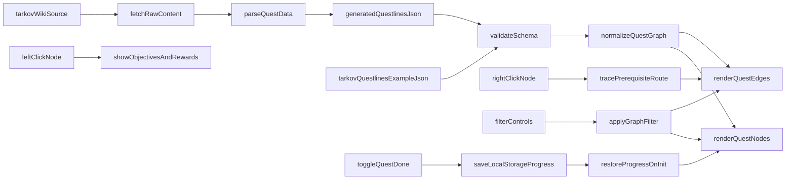

# Tarkov Questline MVP 구현 계획

## 목표
`Game > Tarkov` 패널에서 퀘스트 의존 관계를 시각적으로 확인하고, 좌클릭/우클릭 인터랙션 및 Kappa 조건 색상 표시, 필터와 진행 상태 저장을 포함한 MVP를 완성한다.

## 현재 기반
- 패널 진입 라우팅: [c:/Users/admin/Desktop/Personal/Obsidian_Memo/03. Game/WebProject/js/app.js](c:/Users/admin/Desktop/Personal/Obsidian_Memo/03. Game/WebProject/js/app.js)
- Tarkov 패널 뷰: [c:/Users/admin/Desktop/Personal/Obsidian_Memo/03. Game/WebProject/panels/game-tarkov.html](c:/Users/admin/Desktop/Personal/Obsidian_Memo/03. Game/WebProject/panels/game-tarkov.html)
- Tarkov 모듈: [c:/Users/admin/Desktop/Personal/Obsidian_Memo/03. Game/WebProject/js/modules/game/tarkov.js](c:/Users/admin/Desktop/Personal/Obsidian_Memo/03. Game/WebProject/js/modules/game/tarkov.js)
- 샘플 스키마: [c:/Users/admin/Desktop/Personal/Obsidian_Memo/03. Game/WebProject/data/tarkov-questlines.example.json](c:/Users/admin/Desktop/Personal/Obsidian_Memo/03. Game/WebProject/data/tarkov-questlines.example.json)

## 구현 단계
1. 데이터 모델 고정
- `tarkov-questlines.example.json` 스키마를 MVP 기준으로 확정 (`id`, `name`, `trader`, `minLevel`, `maps`, `prerequisites`, `nextQuestIds`, `wikiUrl`, `objectives[]`, `rewards[]`, `kappaContainer`, 선택적 `x`, `y`).
- `tarkov.js`에 스키마 유효성 검사 함수를 추가해 누락 필드/잘못된 참조를 콘솔 경고로 표준화.

2. 자동 수집/정규화 파이프라인 추가
- 브라우저 CORS 제약을 피하기 위해 로컬 스크립트(`tools/` 또는 `scripts/`)에서 Fandom 원본을 수집한다.
- 수집 레이어와 변환 레이어를 분리한다.
  - 수집: 원본 HTML/API 응답 저장 (`raw` 파일)
  - 변환: 원본에서 퀘스트 정보 추출 후 프로젝트 스키마 JSON 생성
- 최소 명령 인터페이스를 정의한다.
  - 예: `npm run tarkov:sync` 또는 `node scripts/tarkov-sync.js`
  - 결과물: `data/tarkov-questlines.generated.json`
- 파싱 실패/필수 필드 누락 시 경고 리포트를 출력하고, 기존 생성 파일은 덮어쓰기 전 백업한다.

3. 그래프 렌더러 추가
- `game-tarkov.html`에 그래프 캔버스 영역(스크롤 가능한 `div` + `svg`)과 범례 영역을 배치.
- `tarkov.js`에서 노드 렌더링(퀘스트 카드) + 엣지 렌더링(선행/후속 연결선) 구현.
- 데이터 로드 우선순위를 `generated.json` → `example.json` 순으로 둔다.
- 좌표가 없는 데이터는 간단한 자동 레이아웃(라인별 세로 배치 + 깊이별 가로 배치)로 표시.
- 노드 색상 규칙을 추가한다.
  - 기본 색상: 일반 퀘스트
  - 강조 색상: `kappaContainer === "Yes"` 또는 `true` 인 퀘스트
  - 범례에 색상 의미를 명시

4. 노드 인터랙션 추가
- 좌클릭: 선택한 노드의 목표(`objectives`)와 보상(`rewards`)을 우측 상세 패널 또는 팝오버에 표시.
- 우클릭: 선택 노드까지 도달하기 위한 선행 루트(조상 노드 + 연결선)를 그래프에서 하이라이트.
- 우클릭 기본 컨텍스트 메뉴는 `preventDefault`로 막고, 빈 영역 클릭 시 하이라이트를 해제.

5. 필터/검색 UX
- 패널 상단에 `trader`, `minLevel`, `map`, `text search` 필터 UI 추가.
- 필터 결과에 맞춰 노드/엣지 표시를 재계산하고, 매칭되지 않는 항목은 숨김 또는 흐리게 처리.

6. 진행 상태 저장
- 퀘스트 완료 토글 UI를 카드에 추가하고 `localStorage`(`tarkov_quest_progress`)에 저장.
- 완료된 퀘스트 스타일(색상/아이콘) 반영 및 패널 재진입 시 복원.

7. 문서 및 운영 정리
- 기능 문서 업데이트: [c:/Users/admin/Desktop/Personal/Obsidian_Memo/03. Game/WebProject/docs/features.md](c:/Users/admin/Desktop/Personal/Obsidian_Memo/03. Game/WebProject/docs/features.md)
- 구현 현황 업데이트: [c:/Users/admin/Desktop/Personal/Obsidian_Memo/03. Game/WebProject/docs/planning.md](c:/Users/admin/Desktop/Personal/Obsidian_Memo/03. Game/WebProject/docs/planning.md)
- 구조/모듈 설명 업데이트: [c:/Users/admin/Desktop/Personal/Obsidian_Memo/03. Game/WebProject/docs/architecture.md](c:/Users/admin/Desktop/Personal/Obsidian_Memo/03. Game/WebProject/docs/architecture.md)
- Game 작업 규칙/TODO 업데이트: [c:/Users/admin/Desktop/Personal/Obsidian_Memo/03. Game/WebProject/js/modules/game/CLAUDE.md](c:/Users/admin/Desktop/Personal/Obsidian_Memo/03. Game/WebProject/js/modules/game/CLAUDE.md)
- 자동화 사용법/주의사항을 [c:/Users/admin/Desktop/Personal/Obsidian_Memo/03. Game/WebProject/README.md](c:/Users/admin/Desktop/Personal/Obsidian_Memo/03. Game/WebProject/README.md) 에 추가.

## 데이터 흐름

## 완료 기준
- 단일 명령으로 위키 원본 수집 및 프로젝트 스키마 JSON 생성이 가능하다.
- 생성 JSON을 우선 사용해 패널 그래프가 렌더링된다.
- 퀘스트 노드와 선행 관계 엣지가 패널에서 시각적으로 표시된다.
- 좌클릭 시 선택 퀘스트의 목표/보상이 표시된다.
- 우클릭 시 선택 퀘스트까지의 선행 루트가 하이라이트된다.
- `kappaContainer` 조건에 따라 노드 색상이 구분된다.
- 필터(트레이더/레벨/맵/검색)가 동작하고 결과가 즉시 반영된다.
- 완료 상태가 저장/복원된다.
- 관련 문서 4종과 Game 전용 가이드가 최신 상태로 업데이트된다.