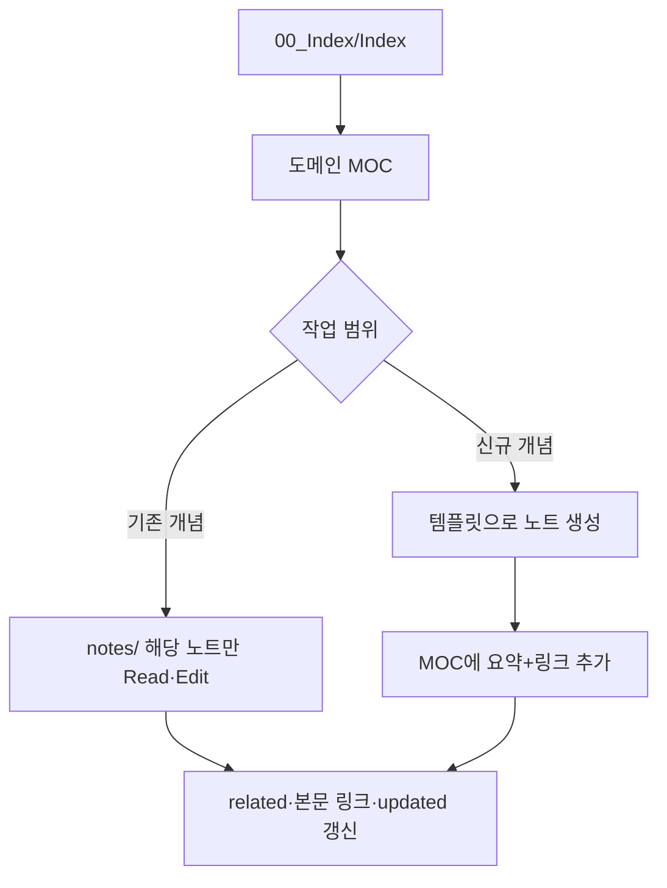

# AI 워크플로우 — MOC 중심 읽기·수정

컨텐츠 개발·기획 수정 시 **폴더 구조가 아니라 MOC 그래프**를 탄다.

## 흐름도

## 단계별

### 1. 진입

- 항상 [[Index]] (또는 `00_Index/Index.md`) 부터
- 작업 영역 MOC 하나만 선택 (예: [[전투 MOC]])

### 2. 읽기

- MOC 본문의 **요약 문단**으로 맥락 파악
- MOC에 나열된 `[[노트]]` 만 열기 — **동일 도메인 전체 notes/ 스캔 금지**

### 3. 수정·생성

| 작업 | 행동 |
|------|------|
| 규칙 변경 | 해당 system 노트만 수정, 연결 노트는 `related` 따라 추가 Read |
| 신규 시스템 | `_templates/system.md` → `notes/system/` → MOC에 링크 |
| 컨텐츠 추가 | `_templates/content.md` → `notes/content/` → MOC |
| 데이터 스키마 | `_templates/data.md` → `notes/data/` → MOC |

### 4. 할 일 동기화

- 원자 노트 `## 5. 미결·TODO` 에 항목을 추가·완료하면 **같은 내용**을 `TODO list/<도메인>-할일.md` 에 반영 ([[TODO-리스트-가이드]])
- «다음 작업» 질의 시 [[할일-인덱스]] → 해당 `*-할일.md` 만 읽기 (notes/ 전체 스캔 금지)

### 5. 마무리

- 수정한 노트 `updated` · 필요 시 `status`
- MOC 요약 문단이 여전히 사실과 맞는지 한 줄 검토
- [[할일-인덱스]] 진행 표 갱신
- 저장소 루트 `AGENTS.md` 체크리스트 확인

## 에이전트·Cursor

- 저장소 루트 `AGENTS.md` 가 이 워크플로우의 실행 규칙이다.
- 기획 질문 시 사용자가 도메인을 주지 않으면 Index → MOC 순으로 스스로 좁힌다.

## 폴더를 쓰지 않는 이유

6단계 폴더는 AI가 "형제 문서" 맥락을 놓치기 쉽다. **얕은 폴더 + MOC 링크**가 지식 그래프 역할을 한다.

- 폴더: 유형별 보관 (`notes/system/` 등) 수준만
- 분류·탐색: **MOC + tags + domain + 링크**
