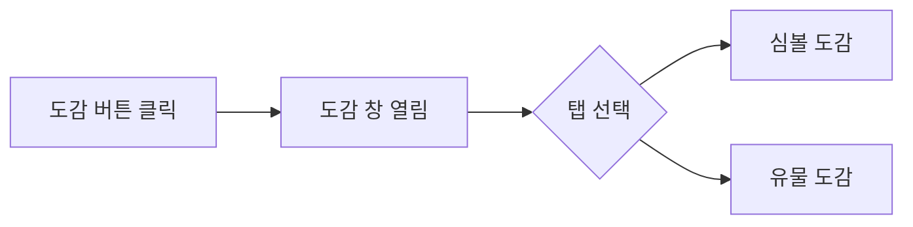

# 슬롯 배틀 개편 상세 기획서

> [!abstract] 문서 개요
> 본 문서는 [[슬롯 배틀 개편 안내서]]의 기초 아이디어를 바탕으로 각 시스템의 상세 규칙, UI/UX 명세, 수치 밸런스, 예외 처리를 기술한 기획 문서이다.
> 
> **작성일:** 2026-05-19  
> **기준 문서:** [[슬롯 배틀 개편 안내서]]

---

## 1. 상점 시스템 개편

### 1.1 심볼 버리기 (Discard Symbol)

#### 1.1.1 개요

심볼 버리기 기능에 ==누진 비용 구조==를 도입하여 라운드 내 무제한 버리기를 방지하고, 플레이어가 신중하게 덱을 관리하도록 유도한다.

#### 1.1.2 누진 비용 규칙

| 버리기 횟수 (당 상점 방문) | 골드 비용 |
|:---:|:---:|
| 1회차 | 3G |
| 2회차 | 4G |
| 3회차 | 5G |
| 4회차 | 6G |
| N회차 | 2 + N G |

> [!info] 비용 초기화 규칙
> - 상점을 **나가는 순간** 버리기 횟수 카운트가 0으로 초기화된다.
> - 이후 같은 라운드 내에서 상점을 재방문해도 1회차 비용(3G)부터 다시 시작한다.
> - 게임 세이브/로드 시에도 상점 이탈 기준으로 초기화 상태를 유지한다.

#### 1.1.3 심볼 버리기 UI 명세

- 버리기 버튼 옆에 **현재 비용 표시**: `버리기 (3G)` → `버리기 (4G)` 형태로 실시간 갱신
- 골드 부족 시 버리기 버튼 **비활성화(Disabled)** 처리 + 툴팁: `"골드가 부족합니다 (필요: Ng)"`
- 심볼 아이콘에 **호버(Hover) 툴팁** 표시:
  - 표시 항목: 심볼 이름, 심볼 등급, 심볼 효과 설명
  - 딜레이: 호버 후 0.3초 뒤 표시
  - 위치: 커서 우상단 오프셋 (겹침 방지)

#### 1.1.4 해골(Skull) 심볼 버리기 제한

> [!warning] 해골 버리기 불가 정책
> 해골 심볼은 버리기 시도 시 다음 처리를 따른다.
> - 버리기 버튼 자체는 노출하되, 클릭 시 **경고 팝업** 표시
> - 팝업 메시지: `"저주받은 심볼은 제거할 수 없습니다."`
> - 해골 아이콘 위에는 `X` 또는 자물쇠 오버레이 아이콘을 렌더링하여 버릴 수 없음을 시각적으로 명시

#### 1.1.5 예외 처리

| 상황 | 처리 방식 |
|---|---|
| 골드 0 상태에서 버리기 시도 | 버튼 비활성화, 툴팁으로 안내 |
| 해골 심볼 버리기 시도 | 경고 팝업 후 취소 |
| 상점 중 골드를 획득하여 비용을 충족 | 버튼 즉시 활성화 |
| 버리기 중 네트워크 오류 (온라인 모드) | 이전 상태로 롤백, 비용 반환 |

---

### 1.2 구매 제한 (Purchase Limit)

#### 1.2.1 개요

한 번의 상점 방문에서 동일 아이템을 중복 구매하지 못하도록 제한하여 전략적 희소성을 강화한다.

#### 1.2.2 구매 제한 적용 범위

| 카테고리 | 제한 규칙 |
|---|---|
| HP 물약 / 회복 아이템 | 상점 방문 1회당 1개 |
| 심볼 구매 | 상점 방문 1회당 동일 심볼 1개 (기존 규칙 유지) |
| 조합 강화 | 상점 방문 1회당 동일 조합 1회 |
| 유물 | 상점 방문 1회당 동일 유물 1개 |

> [!tip] 초기화 시점
> 상점을 **나갈 때** 구매 제한이 초기화된다. 같은 라운드 재방문 시에도 동일 아이템을 1회 더 구매할 수 있다.

#### 1.2.3 구매 제한 UI 명세

- 이미 구매한 아이템은 상점 내에서 **회색 처리(Grayed Out)** 표시
- 회색 처리된 아이템에 호버 시 툴팁: `"이번 방문에서 이미 구매했습니다."`
- 구매 완료된 아이템 우측 상단에 **체크마크 아이콘** 오버레이

#### 1.2.4 예외 처리

| 상황 | 처리 방식 |
|---|---|
| 제한된 아이템 강제 클릭 | 클릭 무반응 + 툴팁 표시 |
| 유물이 드롭 테이블에서 중복 등장 | 서버 로직으로 중복 등장 방지 또는 구매 제한 처리 |

---

## 2. 리스핀 기능 (Respin)

### 2.1 개요

리스핀 기능을 ==라운드 당 1회==로 제한하여 전략적 자원 관리 요소를 추가한다. 추후 유물 및 조합 시스템을 통해 횟수를 확장할 수 있도록 확장성을 고려한다.

### 2.2 기본 규칙

- **기본 리스핀 횟수:** 라운드당 1회
- **리스핀 소모 시점:** 리스핀 버튼을 누른 순간 1회 차감
- **리스핀 초기화 시점:** 새 라운드 시작 시
- **리스핀 잔여 횟수 저장:** 라운드가 끝나지 않는 한 잔여 횟수 유지 (중간 저장 지원 시)

### 2.3 리스핀 확장 조건 (추후 구현)

| 확장 방법 | 추가 횟수 | 조건 |
|---|:---:|---|
| 특정 유물 장착 | +1 | 유물 효과에 명시 |
| 특정 심볼 조합 달성 | +1 | 조합표에 명시 |
| 이벤트 라운드 보상 | +N | 이벤트 설계 시 결정 |

> [!note] 설계 원칙
> 리스핀 확장은 **별도 카운터로 누적**하며, 기본 1회와 합산하여 표시한다. 예: 기본 1 + 유물 1 = 잔여 2회

### 2.4 UI 명세

#### 2.4.1 리스핀 버튼 상태

| 상태 | 시각 표현 |
|---|---|
| 사용 가능 | 버튼 활성화, 잔여 횟수 숫자 표시 (예: `리스핀 [2]`) |
| 사용 불가 (0회) | 버튼 비활성화(회색), 잔여 횟수 `[0]` 표시 |
| 호버 | 잔여 횟수 상세 툴팁: `"리스핀 가능 횟수: 1 / 1"` |

#### 2.4.2 리스핀 실행 시 조합 표시

- 슬롯에 **이미 조합이 성립된 상태**에서 리스핀 버튼을 누르면:
  - 화면 상단 또는 슬롯 위 영역에 **현재 조합식 하이라이트** 표시
  - 메시지: `"현재 [조합명] 조합 중. 리스핀 시 조합이 해제될 수 있습니다."`
  - 확인/취소 팝업 없이 표시만 하고 즉시 리스핀 (UX 흐름을 끊지 않음)
    - *단, 유저 피드백에 따라 확인 팝업 추가 여부 재검토*

#### 2.4.3 리스핀 애니메이션

- 리스핀 버튼 클릭 시 버튼에 **소모 애니메이션** (예: 숫자 감소 이펙트)
- 슬롯 재구동 연출은 기존 스핀 연출과 동일하게 처리

### 2.5 예외 처리

| 상황 | 처리 방식 |
|---|---|
| 리스핀 0회 상태에서 버튼 클릭 | 버튼 비활성, 클릭 무반응 + 툴팁 |
| 리스핀 중 다른 입력 | 리스핀 종료까지 입력 잠금 |
| 리스핀 결과가 이전과 동일 | 정상 처리 (동일 결과 허용) |

---

## 3. 도움말 기능 (Help / Manual)

### 3.1 개요

심볼 목록의 가독성을 개선하여 신규 플레이어가 심볼 종류와 효과를 빠르게 파악할 수 있도록 한다.

### 3.2 심볼 목록 크기 조정

| 항목 | 현재 | 변경 후 |
|---|---|---|
| 심볼 아이콘 크기 | 기준 크기 | 기준 크기 × 3 |
| 심볼 이름 폰트 크기 | 기준 크기 | 기준 크기 × 3 |

### 3.3 레이아웃 조정 규칙

- 각 심볼 항목 사이에 **패딩(여백)** 을 추가하여 아이콘과 글자가 겹치지 않도록 한다.
- 여백은 아이콘 크기 기준 **최소 0.5배** 확보 (세로 방향)
- 심볼 목록 전체가 화면을 초과할 경우 **스크롤** 지원

### 3.4 UI 명세

```
┌─────────────────────────────┐
│  [아이콘 3x]  심볼 이름 3x  │  ← 각 항목
│               심볼 효과 설명 │
│                              │
│  [아이콘 3x]  심볼 이름 3x  │
│               심볼 효과 설명 │
└─────────────────────────────┘
```

- 아이콘은 좌측 정렬, 이름과 설명은 아이콘 우측에 상단 정렬
- 심볼 등급(일반/희귀/전설)은 아이콘 하단에 컬러 뱃지로 표시
- 도움말 창 전체는 기존 UI 레이어 위에 **오버레이** 형태로 표시

### 3.5 예외 처리

| 상황 | 처리 방식 |
|---|---|
| 해상도가 낮아 3배 크기가 화면을 초과 | 스크롤 자동 활성화 |
| 이름/설명 텍스트가 길어 아이콘 영역 침범 | 텍스트 줄바꿈 처리 |

---

## 4. 도감 기능 (Codex)

### 4.1 개요

기존 심볼 도감에 유물 도감을 추가하여 플레이어가 획득한 유물의 효과와 획득 방법을 게임 내에서 확인할 수 있도록 한다.

### 4.2 탭 구조



- **기본 탭:** 심볼 도감 (기존 기능 유지)
- **추가 탭:** 유물 도감 (신규)
- 탭 전환 시 애니메이션: 슬라이드 전환 (좌↔우)

### 4.3 심볼 도감 (기존)

현재 구현된 심볼 도감 기능을 유지하며, 탭 구조 내로 편입한다.

### 4.4 유물 도감 (신규)

#### 4.4.1 표시 항목

| 필드 | 내용 |
|---|---|
| 유물 아이콘 | 유물 이미지 |
| 유물 이름 | 유물 명칭 |
| 유물 등급 | 일반 / 희귀 / 전설 (컬러 코딩) |
| 유물 효과 | 효과 설명 텍스트 |
| 획득 조건 | 상점 구매 / 이벤트 라운드 / 조합 등 |
| 획득 여부 | 현재 런에서 보유 중 / 미보유 표시 |

#### 4.4.2 미획득 유물 표시 정책

| 정책 옵션 | 내용 |
|---|---|
| **A. 잠금 표시** (권장) | 아이콘 실루엣 + `???` 로 표시. 게임 전체 누적 획득 이력이 있으면 이름 공개 |
| B. 완전 숨김 | 획득한 적 없는 유물은 목록에 미노출 |
| C. 전체 공개 | 모든 유물 정보를 처음부터 공개 |

> [!question]- 정책 선택 기준
> 로그라이크 게임에서 **A안**이 일반적으로 탐험 동기를 유지하면서도 기존 플레이어에게 메타 지식을 제공하는 균형적인 방식이다. 최종 결정은 디렉터 검토 후 확정.

#### 4.4.3 UI 명세

- 탭 버튼 위치: 도감 창 상단
- 탭 레이블: `[심볼]` `[유물]`
- 유물 목록: 그리드 레이아웃 (아이콘 N열 배치)
- 유물 클릭 시 우측 또는 하단에 상세 패널 확장

---

## 5. 전투 로그 개선 (Battle Log)

### 5.1 개요

전투 중 발생하는 이벤트 로그를 ==스크롤 가능한 형태==로 개선하여 플레이어가 지난 이벤트를 확인할 수 있도록 한다.

### 5.2 스크롤 구현 규칙

- **최대 표시 줄 수 (고정 영역):** 5줄 (기준값, 조정 가능)
- **최대 보관 로그 수:** 라운드당 최대 50줄 (초과 시 오래된 항목부터 삭제)
- **자동 스크롤:** 새 로그 추가 시 자동으로 최신 항목으로 스크롤
- **수동 스크롤:** 유저가 위로 스크롤하면 자동 스크롤 일시 중단, 최신 버튼 클릭 시 재활성화

### 5.3 로그 항목 포맷

```
[타임스탬프]  이벤트 내용
예) [Round 3]  골드 +5  (조합: 황금 삼각형)
    [Round 3]  HP -10  (적: 오크 전사 공격)
    [Round 3]  유물 [행운의 말굽] 발동
```

- 이벤트 유형별 **컬러 코딩**:
  - 골드 획득: 황금색
  - 데미지: 빨간색
  - 회복: 초록색
  - 유물/심볼 발동: 보라색
  - 시스템 메시지: 흰색

### 5.4 UI 명세

- 로그 창 위치: 기존 위치 유지
- 스크롤바: 우측 세로 스크롤바 표시 (마우스 휠 / 터치 드래그 지원)
- `최신으로` 버튼: 수동 스크롤 시 하단에 버튼 표시, 클릭 시 최신 로그로 이동

### 5.5 예외 처리

| 상황 | 처리 방식 |
|---|---|
| 로그가 50줄 초과 | 가장 오래된 로그부터 순차 삭제 |
| 라운드 종료 | 라운드 구분선 추가 후 로그 유지 |
| 로그 창 크기 조정 (해상도) | 고정 높이 유지, 내부 스크롤 |

---

## 6. 이벤트 라운드 (Event Round)

### 6.1 개요

특정 라운드에서 해골 심볼을 ==획득하는 대신 랜덤 유물을 획득==하는 이벤트 라운드를 추가한다. 이를 통해 게임 진행에 변주를 주고 전략 다양성을 높인다.

### 6.2 이벤트 라운드 발생 조건

| 항목 | 내용 |
|---|---|
| 발생 빈도 | 기본: N라운드당 1회 (구체적 수치는 밸런스 테스트 후 결정) |
| 발생 시점 알림 | 라운드 시작 전 이벤트 배너 표시 |
| 이벤트 종류 (1차 구현) | 해골 → 유물 교체 이벤트 |

> [!tip] 발생 빈도 가이드라인
> 너무 잦으면 해골의 위협감 희석, 너무 드물면 이벤트 체감이 낮다. **5~7라운드당 1회**를 초기값으로 A/B 테스트 권장.

### 6.3 해골 → 유물 교체 이벤트 상세 규칙

#### 6.3.1 기본 동작

1. 이벤트 라운드 시작 시 화면에 **이벤트 알림 배너** 표시
   - 메시지: `"이벤트 라운드! 이번 라운드에서 해골을 획득하면 랜덤 유물로 교체됩니다."`
2. 라운드 진행 중 해골이 슬롯에 등장하는 조건 발생 시, 해골 대신 **랜덤 유물 1개** 지급
3. 지급된 유물은 즉시 인벤토리에 추가, 팝업으로 획득 유물 표시

#### 6.3.2 유물 지급 풀 (Pool) 정의

| 등급 | 지급 가중치 | 비고 |
|---|:---:|---|
| 일반 유물 | 60% | 기본 유물 풀에서 랜덤 |
| 희귀 유물 | 30% | 희귀 유물 풀에서 랜덤 |
| 전설 유물 | 10% | 전설 유물 풀에서 랜덤 |

> [!warning] 중복 지급 정책
> 이미 보유 중인 유물이 선택된 경우:
> - **A안:** 재추첨 (최대 3회, 이후 하위 등급으로 강제 지급)
> - **B안:** 골드로 보상 전환
> 최종 정책은 밸런스 리뷰 후 결정.

#### 6.3.3 이벤트 라운드 알림 UI

- **진입 배너:** 라운드 시작 시 화면 중앙 3초간 표시 후 자동 소멸
- **라운드 중 표시:** 슬롯 UI 상단에 이벤트 아이콘(별 또는 특수 마크) 상시 표시
- **유물 획득 팝업:**
  - 유물 아이콘 + 이름 + 효과 설명 표시
  - `확인` 버튼 클릭 시 팝업 닫힘

### 6.4 추후 확장 가능 이벤트 라운드 목록

| 이벤트명 | 내용 | 구현 시기 |
|---|---|---|
| 유물 보상 라운드 | 해골 → 유물 교체 | **1차 구현** |
| 골드 러시 라운드 | 모든 심볼 골드 배수 증가 | 추후 |
| 강화 라운드 | 특정 심볼 강화 선택 | 추후 |
| 저주 라운드 | 해골 2개 등장 + 보상 강화 | 추후 |

---

## 7. 구현 우선순위

> [!todo] 개발 우선순위 (초안)

| 우선순위 | 기능 | 이유 |
|:---:|---|---|
| P0 | 심볼 버리기 누진 비용 | 밸런스 직결, 핵심 경제 시스템 |
| P0 | 리스핀 횟수 제한 | 전투 루프 균형 |
| P1 | 구매 제한 | 경제 루프 완성 |
| P1 | 전투 로그 스크롤 | UX 필수 개선 |
| P2 | 도감 유물 탭 추가 | 컨텐츠 확장 |
| P2 | 이벤트 라운드 | 게임플레이 변주 |
| P3 | 도움말 크기 개선 | 신규 플레이어 UX |

---

## 8. 미결 사항 (Open Questions)

- [ ] 리스핀 조합 표시 시 확인 팝업 필요 여부 → UX팀 검토 필요
- [ ] 유물 도감 미획득 유물 표시 정책 (A/B/C안) → 디렉터 결정 필요
- [ ] 이벤트 라운드 중복 유물 지급 정책 → 밸런스팀 검토 필요
- [ ] 심볼 버리기 최대 비용 상한선 설정 여부 (무한 증가 vs 상한 고정) → 밸런스팀 검토 필요
- [ ] 이벤트 라운드 발생 빈도 구체적 수치 → 플레이 테스트 후 결정
