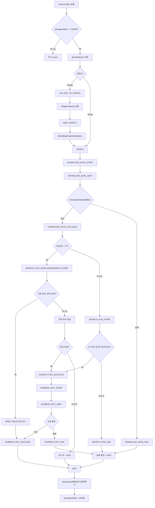

← [[MKSummonNpcManager_Function_Analysis_Index]]


# MKSummonNpcManager `SummonNpc()` 분석

## 개요

`MKSummonNpcManager`는 NPC 소환을 단일 함수 호출로 끝내지 않고, `SUMMON_NPC_STATE` 기반 상태머신으로 분해해 처리한다.  
진입점은 `SummonNpc(long _item_id, long _npc_id, MKSceneManager.MKSceneEnum _cur_scene)`이며, 이후 실제 처리(월드 전환, 블록 데이터 다운로드, 소환 위치 탐색, 서버 요청, 종료 정리)는 `Update()`에서 상태별 `Updata_*` 함수로 진행된다.

핵심 의도는 아래 두 가지다.
- 씬 전환/네트워크/탐색 같은 비동기 단계를 상태로 분리해 순차 처리
- 실패 시 일관된 종료 루틴(`END`)과 사용자 피드백(토스트/팝업) 보장

## 분석 대상 함수

```csharp
public void SummonNpc(long _item_id, long _npc_id, MKSceneManager.MKSceneEnum _cur_scene)
{
    if (ManagerState != SUMMON_NPC_STATE.NONE) return;

    ItemID = _item_id;
    NpcID = _npc_id;

    switch (_cur_scene)
    {
        case MKSceneManager.MKSceneEnum.MKSCENE_VILLAGE:
            ManagerState = SUMMON_NPC_STATE.VILLAGE_TO_WORLD;
            return;

        case MKSceneManager.MKSceneEnum.MKSCENE_WORLD:
            ManagerState = SUMMON_NPC_STATE.WORLD;
            return;
    }
}
```

이 함수 자체는 "작업 예약" 역할이고, 실질 로직은 후속 상태에서 실행된다.

## 전체 흐름도 (State Machine)



## 주요 책임/구성 요소

- `SummonNpc()`: 호출 입력(`item`, `npc`, `scene`)을 상태머신 시작 상태로 변환
- `Update()`: 상태 라우터. 현재 상태에 맞는 `Updata_*` 단계를 한 프레임 단위로 실행
- `Updata_World()`: 쿨타임/소환 제한 검사, 대기 UI 오픈
- `DownloadBlockData()`: 월드 블록 정보 다운로드 대기 및 검색 준비
- `Updata_SearchPosStart()` / `Updata_WorldObjSearchPosStart()`:
  - 아이템 소환: 주변 빈 리젠 포인트 탐색
  - 비아이템 소환: 기존 NPC 탐색 우선, 없으면 후보 리젠 계산
- `Updata_SummonNpcStart()`: 실제 서버 요청 분기
  - `Request_SummonRallyNPC` (아이템)
  - `Send3058_FindNPC` (비아이템)
- `Updata_End()`: 탐색 종료, UI 닫기, 터치 입력 복원, 상태 초기화

## 데이터/의존성 관계

- 입력/내부 상태
  - `ItemID`, `NpcID`, `ManagerState`, `RegenDataList`
- 주요 의존 시스템
  - `WorldSearchPopup`: NPC 생성 시간 로드/저장, 블록 검색 시작/종료
  - `MKEmptyPosSearchManager`: 빈 리젠 포인트 탐색 및 검색 종료
  - `WorldManager`: 월드 객체 검색, 블록 범위 확인, 카메라 이동, 위치 아이콘
  - `NetworkItem`, `WorldNetwork`: 실제 소환 요청 네트워크 송신
  - `CommonDocManager`, `WorldUIDocuments`: 입력 차단 및 탐색 대기 UI 제어
  - `MKGameDataModel`, `WorldDataManager`, `MKUserDataModel`: NPC/영토/리젠 데이터 조회

## 문제점 및 개선 제안

1. 메서드 명 오탈자/일관성 저하
- `Updata_*` 오탈자가 전반에 존재해 검색성과 가독성이 떨어진다.
- 개선: `Update*` 또는 `Handle*State` 네이밍으로 통일.

2. 상태 전이와 부수효과가 분산
- 상태 변경, UI 제어, 네트워크, 데이터 탐색이 여러 함수로 흩어져 있어 추적 비용이 높다.
- 개선: 상태 전이 전용 헬퍼(예: `TransitionTo(state)`)를 두고 로깅/검증을 중앙화.

3. `ItemID == 0`의 의미적 결합
- "아이템 미사용 소환"이라는 도메인 의미가 매직 조건(`0`)에 하드코딩됨.
- 개선: `bool isItemSummon` 파생 변수 또는 enum으로 명시화.

4. 실패 처리 분기 중복
- `*_FAIL`에서 대부분 `SetFailPopupToEnd()`로 수렴하지만 분기 단에서 반복됨.
- 개선: 공통 실패 코드/원인 enum을 도입해 메시지와 종료를 일원화.

5. 대형 함수 집중 (`Updata_WorldObjSearchPosStart`)
- 기존 NPC 검색, 거리 계산, 인접 영토 확장, 후보 필터링, 후속 상태 전이를 한 함수가 담당.
- 개선: "후보 수집/필터링/최종선정"을 별도 함수로 분리해 테스트 가능성 강화.

## 게임 플레이/성능/메모리 영향

- 게임 플레이
  - 장점: 월드 전환 유무를 자동 흡수해 UX를 단순화.
  - 리스크: 상태 전이가 길어 실패 원인 체감이 어렵고, 사용자 입장에서 "왜 실패했는지" 피드백이 약할 수 있음.

- 성능
  - `WorldObjSearch` 경로에서 LINQ 체인과 리스트 생성(`ToList`, `Select`, `Where`)이 다수 발생.
  - 후보군이 큰 영토에서는 프레임 타이밍에 따라 스파이크 가능성이 있음.
  - 개선: 재사용 버퍼(List pooling), 조건 순서 최적화, 필요 시 코루틴 분할 처리.

- 메모리
  - 탐색 시 익명 객체 리스트와 중간 컬렉션이 다수 생성되어 GC 압력 유발 가능.
  - 개선: 구조체 기반 임시 버퍼 또는 재사용 가능한 캐시 컬렉션 도입 검토.

## 디버깅 포인트 체크리스트

- `ManagerState != NONE` 상태에서 재호출 시 무시되는지 확인
- `WorldMapFogEndCallback`가 항상 null로 되돌아가는지 확인
- `DOWNLOAD_DATA_WAIT`에서 콜백 미도착 시 정체 여부 확인
- `SEARCH_POS_WORLDOBJSEARCH_START`에서 후보 0건 시 토스트 키 정상 출력 확인
- `END` 진입 후 터치 입력 복구(`SetTouchBlock(false)`) 누락 여부 확인

## 2026-03 로그 계측 업데이트

최근 수정으로 `SummonNpc` 플로우에 Crashlytics non-fatal 기반 추적이 전면 추가되었다.  
핵심 목적은 "팝업 미노출 + 소환 실패" 상황을 재현 없이 로그만으로 역추적하는 것이다.

### 추가된 추적 구조

- 공통 추적 함수: `TraceSummonStep(step, message, context, isFailure)`
- 이벤트 키: `SummonNpcFlow`
- 호출부 컨텍스트 주입:
  - `EventUi.Challenge.ClickNpcSerch`에서 `SetExternalTraceContext(...)` 호출
  - `event_id`, `difficulty`, `clear_level`, `npc_search_enabled` 등을 `ext_*`로 전달

### 로그 필드(주요)

- 요청 식별: `attempt_id`, `step_index`
- 시간축: `elapsed_ms`, `frame`
- 상태/입력: `state`, `item_id`, `npc_id`, `regen_count`
- 맥락: `caller_source`, `request_scene`, `current_scene`
- 월드 데이터: `my_planet_no`, `my_territory_no`
- 앱 정보: `platform`, `app_version`

### 운영에서 보는 순서

1. `ChallengeNpcSearchClick` 이벤트로 버튼 클릭 요청 여부 확인
2. 동일 시점의 `SummonNpcFlow`에서 `attempt_id`를 기준으로 step 체인 정렬
3. 마지막 step에서 실패 타입 식별 (`CanCreateNPC failed`, `No candidate found`, `Blocked busy state`, `Network fail callback` 등)
4. `ext_event_id`, `ext_difficulty`, `my_planet_no`를 함께 보고 데이터 조건 문제와 로직 문제를 분리

## 관련 문서

- [[FirebaseManager_Analysis]]
- [[WorldSocketDataModel]]
- [[MKSummonNpcManager_Crashlytics_LogGuide]]


