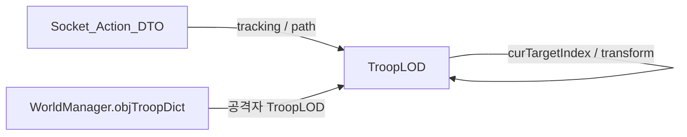

← [[TroopLOD_Function_Analysis_Index]]

# TroopLOD 전투 임박 경로 클램프 및 스폰 위치 보정

## 개요

피격군이 **전투(`BATTLE`) DTO 반영 전**에도 `move_path_slot`을 따라 교차 접점을 지나 원래 목적지로 계속 이동해 보이는 문제(15483 vs 12885 시나리오)를 줄이기 위해, 클라이언트에서 **전투 임박 소프트 클램프**를 적용했다. 추가로 군단 **최초 생성 시** 격자용 `GetCurrentPos()` 대신 경로 보간 위치를 쓰도록 보정했다.

**관련 선행 분석**: [[TroopData_15483_vs_12885_PassThrough_Analysis]]

**코드 위치 (레포)**: `Assets/World/Scripts/TroopLOD.cs`  
**DTO**: `Socket_Action_DTO` — `tracking_slot_id_arr`, `move_path_slot`, `GetCurrentPos` / `GetCurrentDetailPos` (`WorldSocketDataModel.cs`)

---

## 주요 책임·구성 요소

| 구분 | 설명 |
|------|------|
| 공격자 식별 | `tracking_slot_id_arr`의 `(user_no, fleet_slot_id)` → `objTroopDict` 키 매칭, `target_type == USER` 및 `target_key == 피격군 key` |
| 역방향 보조 | 추적 배열로 못 찾을 때 `objTroopDict` 역스캔(프레임 분산, 24프레임 간격) |
| 접점 인덱스 | 공격자 경로 **마지막 웨이포인트**와 피격군 `move_path_slot`의 `px/py` **제곱 거리**로 cap 인덱스 산출 |
| 임박 게이트 | 접점 `move_time` 기준 리드 타임(6s), `touchPos`·접점·공격자 간 거리(3.5) |
| 경로 고정 | `curTargetIndex` 상한, `UpdatePosAndRot`에서 접점에서 **인덱스 증가 차단** |
| 표시 동기 | `HIDE==false` 시 `GetCurrentPos` 격자 대신 **클램프된 서버 시간 보간** 위치 적용 |
| 스폰 | `GetSpawnWorldPositionFromDto`: 경로 2개 이상이면 `GetCurrentDetailPos()`, 아니면 `MakePos(GetCurrentPos())` |

---

## 데이터·의존성 관계

- 서버가 피격군 DTO에 넣는 **`tracking_slot_id_arr`**가 1순위 신호( `NetworkTroop.UpdateAttacker` 등과 연계).
- `SetTroopSlotData` → `InvalidateBattleImminentPathCache` → `UpdateTargetQuaternionFromMovePath` → `ApplyCreateInitialization`(생성 시) → `ApplyPathAndPositionUpdate` 순서 유지.

---

## `Socket_Action_DTO.GetCurrentPos()` 메모 (평가 요지)

- **역할**: 서버 시각 기준 경로 보간 후 **격자 셀(`long`)** 반환, 네비 존재 시 타일 보정.
- **스폰/디테일과의 차이**: `GetCurrentDetailPos()`는 같은 시각의 **연속 보간 Vector3** — 생성 직후 격자만 쓰면 궤적과 어긋날 수 있음.
- **개선 여지(별도 작업)**: `targetIdx==0` 처리 순서, Lerp 분모 0, `containPoint` 실패 후 제어 흐름 등은 DTO 쪽 리팩터 시 정리 권장.

---

## 최적화 요약

- 프레임당 **cap 결과 캐시** (`Time.frameCount`).
- `GetBattleImminentMaxWaypointIndex()` **중복 호출 제거** (`UpdatePosAndRot` 내 지역 변수 재사용).
- 거리 비교 **sqrt 제거**(제곱 거리, `WaypointMatchEpsilonSq` 등).
- `tracking` 비어 있고 역스캔 프레임이 아니면 **조기 반환**.
- `TryGetBattleImminentClampedWorldPosition`에서 `px/py` **직접 보간**.

---

## 문제점 및 잔여 리스크

| 리스크 | 완화 |
|--------|------|
| 임계값 과도 → 정상 행군이 멈춤 듯 보임 | 상수 튜닝, `[TroopBattleImminent]` 디버그 로그(빌드 한정) |
| 접점과 경로 끝점 불일치 | `FallbackMeetMaxDist` 내 최근접 웨이포인트 |
| 전투 DTO 장기 지연 후에도 클램프 | `capTime + 2 * LeadTime` 경과 시 클램프 해제 |
| 역스캔 지연(24프레임) | 추적 배열이 채워지면 매 프레임 추적 루프만 사용 |

---

## 게임플레이·성능·메모리 영향

- **플레이**: 피격군이 교전 직전 원래 목적지로 “슬쩍” 빠져 나가는 연출 감소.
- **성능**: 대부분의 군단은 `CanApply` 또는 조기 반환으로 비용 미미; 역스캔은 분산.
- **메모리**: 상시 할당 추가 없음(캐시 필드만 증가).

---

## 관련 노트

- [[TroopData_15483_vs_12885_PassThrough_Analysis]]
- [[TroopLOD_SetTroopSlotData_Analysis]]
- [[TroopLOD_Movement_Rotation_Path_Analysis]]
- [[TroopLOD_DTO_SyncPipeline_Analysis]]
- [[NetworkTroop_UpdateAttacker_Analysis]]

