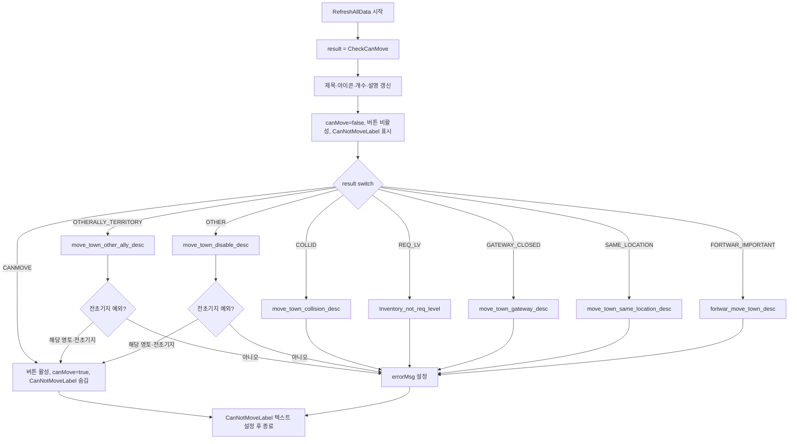

---
tags:
  - system/ui
  - system/world
  - concern/readability
  - status/done
aliases:
  - 마을 이동 아이템 팝업 분석
  - CheckCanMove RefreshAllData 플로우
---

# WorldUseMoveCityItemPopup — CheckCanMove / RefreshAllData 분석

## 개요

`WorldUseMoveCityItemPopup`은 **월드맵에서 빈 땅을 선택했을 때** 뜨는 **마을 이전 아이템 사용 팝업**이다.  
두 함수의 역할은 다음과 같다.

| 함수 | 역할 |
|------|------|
| **CheckCanMove()** | 선택한 목표 위치·영토·아이템 보유량을 종합해 **이동 가능 여부(MOVE_CASE)** 를 판정한다. |
| **RefreshAllData()** | `CheckCanMove()` 결과를 받아 **UI(버튼 활성/비활성, 에러 메시지)** 를 갱신한다. |

- **위치**: `Assets/World/Scripts/UI/WorldUseMoveCityItemPopup.cs`
- **호출 맥락**: 팝업 `OnEnable` 시 `RefreshAllData()` 호출 → 내부에서 `CheckCanMove()` 호출

---

## 1. CheckCanMove() 플로우

### 1.1 입력·사전 계산

- **targetPos**: `WorldManager.instance.camManager.movecity.transform.position` (이동 목표 월드 좌표)
- **targetNo**: `MakeSourceNum((long)targetPos.x, (long)targetPos.z)`
- **terget_territory_id**: 목표 영토 ID (코드 내 오타: `terget` → target)
- **targetSector**: `MKNavMeshManager.Instance.GetSectorIndex(targetPos)` — 목표 섹터
- **CheckMove**: `movecity.CheckCanMoveSector()` — 공통 막기(충돌/타연맹/동일위치/산맥 등) 0~5
- **territory_state**: `MKCommon.CheckTerritoryState(terget_territory_id, ...)` — MYALLY_*, OTHERALLY_*, FREE_TERRITORY, FORTWAR_IMPORTANT 등
- **isGateWayOpen**: `MKCommon.CheckCanGoBySector(targetSector)` — 관문 열림 여부
- **isAllyLeaderTerritory**: 연맹장이 있는 영토인지
- **IsAllyTerritory**: MYALLY_DISABLE 또는 MYALLY_ENABLE
- **isNewCityCreateSector**: 신규 도시 생성 구역이고 타연맹 활성 점령이 아닌지
- **allycenter**: 연맹 중심 건물 (c_type==1, category==1)
- 아이템 보유 플래그: `CanSetDefaultMoveItem`, `CanSetAllyRangeMoveItem`, `CanNewCreateMoveItem`, `fw_CanSetAllyRangeMoveItem` (요새전 연맹 이전)

### 1.2 UseItemID 결정 (ItemFixed == false 일 때)

목표 영토/연맹/관문/아이템 보유에 따라 사용할 아이템 ID를 정한다.

- 타연맹(OTHERALLY_*) → `MOVE_VILLAGE_ITEM`
- 내 연맹 영토 → 요새전이면 `FW_ALLY_RANGE_MOVE_VILLAGE_ITEM` 가능 시 그걸, 아니면 `ALLY_RANGE_MOVE_VILLAGE_ITEM`
- 연맹 중심과 동일 영토 → 위와 동일 (연맹/요새전 연맹)
- 연맹 중심만 있고 다른 영토 → `MOVE_VILLAGE_ITEM`
- 연맹장 영토 → 연맹/요새전 연맹 아이템
- 관문 열림 → `MOVE_VILLAGE_ITEM`
- 신규 도시 생성 구역 + 초기 지역 이전 아이템 보유 → `NEW_CREATE_MOVE_VILLAGE_ITEM`
- 그 외 → `MOVE_VILLAGE_ITEM`
- 연맹/요새전 연맹 아이템으로 정했는데 해당 아이템 없으면 → `MOVE_VILLAGE_ITEM`으로 fallback

### 1.3 CheckMove 스위치 (공통 막기)

- **1** → `COLLID` (충돌)
- **2** → `OTHERALLY_TERRITORY`
- **4** → `SAME_LOCATION`
- **5** → `OTHER`
- **0** → 레벨 체크: `req_lv > CityHallLv` 이면 `REQ_LV`, 아니면 break 후 아이템별 로직으로
- **default** → 로그 에러 후 break

### 1.4 아이템별 최종 MOVE_CASE

- **연맹/요새전 연맹 아이템** 또는 **요새전 씬**:
  - 연맹 영토 또는 (무주지 && 연맹장 영토) → `CANMOVE`
  - 타연맹(OTHERALLY_*) → `OTHERALLY_TERRITORY`
  - FORTWAR_IMPORTANT → `FORTWAR_IMPORTANT`
  - 그 외(무주지 등) → `OTHER`
- **MOVE_VILLAGE_ITEM**:
  - 관문 닫힘 → 연맹 영토면 `CANMOVE`, 아니면 `GATEWAY_CLOSED`
  - 관문 열림 → 타연맹 활성(OTHERALLY_ENABLE)이면 `OTHERALLY_TERRITORY`, 아니면 `CANMOVE`
- **NEW_CREATE_MOVE_VILLAGE_ITEM**: 신규 도시 생성 구역이면 `CANMOVE`, 아니면 `OTHER`
- 그 외 → `CANMOVE`

### 1.5 CheckCanMove() 플로우차트 (Mermaid)

```mermaid
flowchart TD
    subgraph Input["입력·사전 계산"]
        A[targetPos, targetNo, terget_territory_id, targetSector]
        B[CheckMove = CheckCanMoveSector]
        C[territory_state, isGateWayOpen, isAllyLeaderTerritory]
        D[아이템 보유 플래그]
    end

    subgraph UseItemID["UseItemID 결정 (ItemFixed=false)"]
        E{territory_state?}
        E -->|OTHERALLY_*| F[MOVE_VILLAGE_ITEM]
        E -->|IsAllyTerritory 등| G[연맹/요새전 연맹 아이템]
        E -->|기타| H[MOVE_VILLAGE_ITEM / NEW_CREATE 등]
    end

    subgraph CheckMoveSwitch["CheckMove 스위치"]
        I{CheckMove}
        I -->|1| J[return COLLID]
        I -->|2| K[return OTHERALLY_TERRITORY]
        I -->|4| L[return SAME_LOCATION]
        I -->|5| M[return OTHER]
        I -->|0| N{req_lv > CityHallLv?}
        N -->|Yes| O[return REQ_LV]
        N -->|No| P[break]
    end

    subgraph ItemLogic["아이템별 판정"]
        Q{UseItemID / 씬?}
        Q -->|연맹·요새전 연맹 또는 요새전 씬| R{영토 상태}
        R -->|연맹 or 무주지+연맹장| S[return CANMOVE]
        R -->|타연맹| T[return OTHERALLY_TERRITORY]
        R -->|FORTWAR_IMPORTANT| U[return FORTWAR_IMPORTANT]
        R -->|그 외| V[return OTHER]
        Q -->|MOVE_VILLAGE_ITEM| W{isGateWayOpen?}
        W -->|No| X{IsAllyTerritory?}
        X -->|Yes| S
        X -->|No| Y[return GATEWAY_CLOSED]
        W -->|Yes| Z{OTHERALLY_ENABLE?}
        Z -->|Yes| T
        Z -->|No| S
        Q -->|NEW_CREATE_MOVE_VILLAGE_ITEM| AA{isNewCityCreateSector?}
        AA -->|Yes| S
        AA -->|No| V
        Q -->|기타| S
    end

    A --> E
    B --> I
    P --> Q
```

---

## 2. RefreshAllData() 플로우

### 2.1 공통 UI 갱신

1. `result = CheckCanMove()` 호출
2. 제목·아이콘·아이템 개수·설명 라벨을 `UseItemID` 기준으로 갱신
3. 기본값: `canMove = false`, 사용 버튼 비활성, 구매 버튼 비활성, `CanNotMoveLabel` 표시

### 2.2 result 별 분기 (switch)

| MOVE_CASE | UI 동작 | 에러 메시지 키 |
|-----------|---------|-----------------|
| **CANMOVE** | 사용/구매 버튼 활성, canMove=true, CanNotMoveLabel 숨김 | — |
| **COLLID** | — | move_town_collision_desc |
| **REQ_LV** | — | Inventory_not_req_level ({{req_lv}}) |
| **OTHERALLY_TERRITORY** | 기본은 비활성. **전초기지 예외**: 같은 영토·category==3·c_type==1·c_status==1 이면 이동 가능 처리 | move_town_other_ally_desc |
| **GATEWAY_CLOSED** | — | move_town_gateway_desc |
| **SAME_LOCATION** | — | move_town_same_location_desc |
| **FORTWAR_IMPORTANT** | — | fortwar_move_town_desc |
| **OTHER** | 기본은 비활성. **전초기지 예외**: 같은 영토·category==3·c_type==1 이면 이동 가능 처리 | move_town_disable_desc |

마지막에 `CanNotMoveLabel.text`를 `MKTerm.Instance.GetTerm(errorMsg, erroMsg_Keys)` 등으로 설정한다.

### 2.3 RefreshAllData() 플로우차트 (Mermaid)

---

## 3. 데이터·의존성 관계

| 의존 컴포넌트/매니저 | 용도 |
|----------------------|------|
| WorldManager.instance.camManager.movecity | 목표 위치, CheckCanMoveSector() |
| MKCommon | MakeSourceNum, MakeTerriotyNo, CheckTerritoryState, CheckCanGoBySector, MOVE_CASE/TERRITORY_STATE |
| MKNavMeshManager.Instance | GetSectorIndex |
| MKUserDataModel.instance | nation, GetItemCount, CityHallLv |
| AllyManager.instance | AllyMemberDict, myAllyCenterList |
| MKGameDataModel.instance.item | GetData(UseItemID).req_lv, GetItemTerm |
| MKConstant | GetConstData("NEW_CITY_CREATE_SECTOR") |
| MKSceneManager.instance | GetCurMKScene (요새전 여부) |
| MKTerm.Instance | GetTerm (에러 메시지·버튼 문구) |
| MKSpriteAtlasManager.Instance | GetItem_BG |

---

## 4. 문제점 및 개선 제안

- **오타**: `terget_territory_id` → `target_territory_id` 로 통일하면 가독성·검색에 유리하다.
- **CheckCanMove() 길이**: 조건·스위치·아이템별 분기가 한 메서드에 모여 있어 복잡하다.  
  - **제안**: “UseItemID 결정”, “CheckMove 공통 막기”, “아이템별 MOVE_CASE 반환”을 private 메서드로 나누면 단위 테스트와 유지보수가 쉬워진다.
- **전초기지 예외 중복**: `OTHERALLY_TERRITORY`와 `OTHER` 케이스에서 비슷한 전초기지 LINQ/예외 처리가 반복된다.  
  - **제안**: “해당 영토에 내 연맹 전초기지가 있는지”를 한 번만 계산하는 헬퍼(예: `IsNearOutPostForMove(terget_territory_id)`)로 묶고, 두 케이스에서 공통 사용하면 중복 제거 및 규칙 변경 시 한 곳만 수정 가능하다.
- **디버그 로그**: `CheckMove` default 시 `Debug.LogError("???????")` 는 의미가 불명확하다.  
  - **제안**: `CheckCanMoveSector()` 반환값과 “예상 0~5”를 명시한 메시지로 바꾸면 디버깅에 도움이 된다.

---

## 5. 게임 플레이/성능/메모리 영향

- **게임 플레이**: 이동 가능/불가와 사용 가능 아이템 종류가 이 로직에 직접 연동된다. 전초기지 예외는 “타연맹/기타 불가”일 때도 전초기지 인근은 이동 가능하게 만든다.
- **성능**: `RefreshAllData()`는 팝업 열릴 때 1회 호출된다. `CheckCanMove()` 내부의 LINQ·리스트 탐색·상수 조회는 호출 빈도가 낮아 부하는 크지 않다. 다만 `AllyManager.instance.myAllyCenterList` 등에 대한 반복 조회가 많으므로, 나눈 메서드에서 “한 번만 계산한 값”을 인자로 넘기면 불필요한 중복 계산을 줄일 수 있다.
- **메모리**: 상수 리스트(`create_sector`), LINQ 결과 등은 지역 변수로 짧은 생명주기. 특별한 할당 누수 우려는 낮다.

---

## 6. 관련 문서·코드

- [[World_IsVisibleMoveData_MovePath_Analysis]] — 월드 이동·가시성 관련
- `MKCommon.CheckTerritoryState`, `MKCommon.CheckCanGoBySector` — 영토/관문 판정
- `WorldManager.instance.camManager.movecity.CheckCanMoveSector()` — 공통 막기(충돌/타연맹/동일위치/산맥 등)

---

## 7. 정리

- **CheckCanMove()**: 목표 좌표·영토·관문·연맹·아이템 보유를 반영해 `UseItemID`를 정한 뒤, `CheckCanMoveSector()` 공통 막기를 먼저 적용하고, 통과 시 **아이템별**로 `MOVE_CASE`를 반환한다.
- **RefreshAllData()**: 위 결과로 버튼 활성/비활성과 `canMove`를 설정하고, **전초기지 예외**를 적용한 뒤, 에러 메시지 키로 `CanNotMoveLabel`을 갱신한다.
- 플로우차트는 위 Mermaid로 정리했으며, 리팩터 시 “UseItemID 결정 / 공통 막기 / 아이템별 판정” 분리와 전초기지 예외 공통화를 추천한다.
