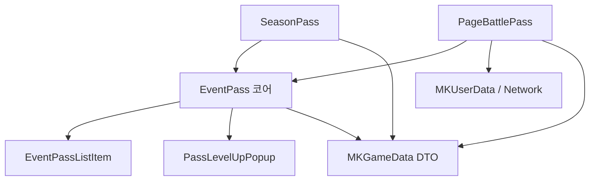

# EventPass 문서 허브

Unity 클라이언트 `Assets/Common Document/Scripts/EventPass.cs` 를 중심으로 한 **이벤트/시즌/배틀 패스 UI 공통 모듈** 맵입니다.

## 상세 문서 (권장 읽기 순서)

1. [[EventPass 데이터 흐름]] — 시즌 vs 배틀, 테이블→UI, 네트워크 콜백
2. [[EventPass UI 구조]] — `Q` 이름, 리스트 템플릿, 팝업 UXML
3. [[EventPass 제약사항 및 필수 요소]] — 인덱스·배열·고정 가정·풀 이름
4. [[EventPass 신규 생성 체크리스트]] — 신규 패스 화면 추가 시 작업 목록

## 핵심 스크립트 (직접 연결)

| 역할 | 노트 |
|------|------|
| 패스 페이지 공통 로직 | [[EventPass 코어]] |
| 레벨 한 줄 UI 아이템 | [[EventPassListItem]] |
| 레벨업 구매 팝업 | [[PassLevelUpPopup]] |
| 시즌 이벤트 패스 화면 | [[SeasonPass]] |
| 프로모션 배틀 패스 페이지 | [[PageBattlePass]] |

## 데이터·네트워크

- [[게임데이터 MKGameDataDTO]] — `MKEventPass*`, 시즌 패스 레벨 DTO
- [[유저데이터 네트워크]] — `MKEventPassSlotDTO`, `battle_pass_list` 동기화

## UI·패키지·기타 참조

- [[UI 및 패키지]] — `EventUi`, `PackageSingleUi`, `BenefitUi` 등
- [[공통 의존성]] — `RewardItemData`, 풀, 스크롤, 용어 등

## 리포지토리 경로 (원본)

프로젝트 루트: `c:\Users\admin\Documents\aa_client_lfs`

```
Assets/Common Document/Scripts/EventPass.cs
Assets/Common Document/Scripts/EventPassListItem.cs
Assets/Common Document/Scripts/PassLevelUpPopup.cs
Assets/Common Document/Scripts/Season Event/Common/SeasonPass.cs
Assets/Common Document/Scripts/Promotion/PageBattlePass.cs
```

## 관계 요약


