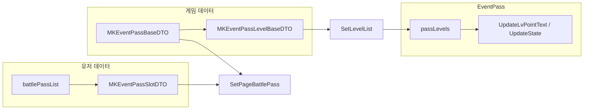
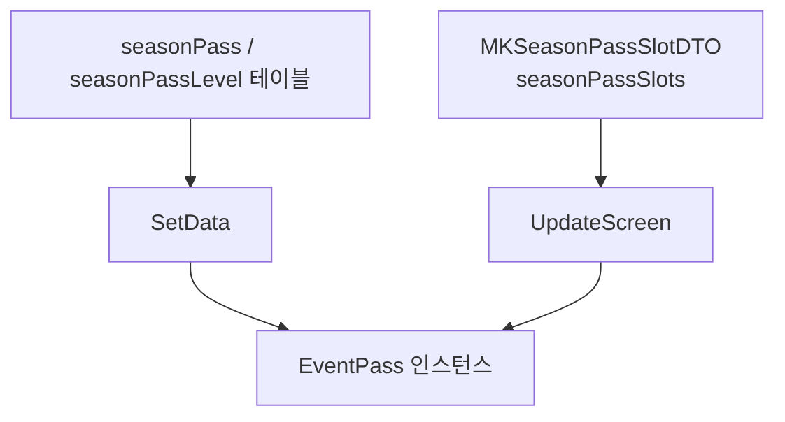

# EventPass 데이터 흐름 (상세)

상위 개요는 [[게임데이터 MKGameDataDTO]], [[유저데이터 네트워크]] 와 연결된다. 여기서는 **화면까지의 단계**를 시즌/배틀로 나눈다.

---

## 1. 공통 변환: 테이블 → `EventPassLevelRewardData`

`EventPass.SetLevelList` 는 최종적으로 `List<EventPassLevelRewardData> passLevels` 를 만든 뒤, 동일한 `SetLevelList(..., listItem, ReqReward)` 로 리스트를 그린다.

| 필드 | 의미 |
|------|------|
| `eventID` | 이벤트/시즌 이벤트 ID |
| `level` | 패스 레벨 |
| `startPt` | 해당 레벨 구간 시작 누적 포인트 |
| `dicRewards` | **등급(grade)** → `List<RewardItemData>` (UI·연출용) |

**이벤트(배틀) 패스 경로** (`MKEventPassLevelBaseDTO`):

1. `MKGameDataModel.instance.eventPass` / `eventPassLevel` / `eventPassReward` 에서 레벨·보상 행 로드.
2. `MKEventPassBaseDTO.GetLevels()` 가 `event_id` 기준으로 `MKEventPassLevelBaseDTO` 리스트를 정렬·캐시.
3. 각 레벨에 대해 `reward_key_arr` 의 **인덱스 `i` = 등급** 으로 `GetRewards(i, minDay)` 호출 → `MKPassRewardBaseDTO` 리스트.
4. `ITEM_ON_SERVER` 등은 `GetRewards` 내부에서 `eventOntimeReward` 로 치환.
5. `EventPassLevelRewardData.SetRewards(grade, ...)` 로 `RewardItemData` 변환 후 `dicRewards` 에 저장.

**시즌 패스 경로** (`MKSeasonPassLevelBaseDTO`):

1. `MKGameDataModel.instance.seasonReward` 에서 `GetRewards(x.GetRewardID((PASS_GRADE)i))` 로 등급별 보상.
2. 등급 루프는 코드상 **`0` ~ `(int)PASS_GRADE.SUPER_PREMIUM` 고정** (3트랙 가정, `@TODO` 주석 있음).

`SetLevelList`(이벤트) 시 **`pointID`** = `eventPass.GetEventData(event_id)?.pass_point_id` — [[EventPass 코어]] 의 `OnClickHowGet` → `InfoitemPopup.OpenPassPoint` 에 사용.

---

## 2. 배틀 패스 (`PageBattlePass`) 데이터 흐름

### `SetPageBattlePass(eventID, ...)`

1. `passDt = eventPass.data.Find(event_id)`.
2. `tracks`: 인덱스 `-1..pkg_idx_arr.Count-1` 루프로 `Track` 생성 — **첫 트랙 `pkgIdx = 0` (무료)**, 이후 `pkg_idx_arr[i]` (코드 주석: 기획상 grade 대신 고정 term 키 `text_freepass` 등 사용).
3. `SetLevelList(levelDts, sampleListItem, ReqPassReward, passSlotDt.min_day)` — **`min_day`** 가 `GetRewards` 에 전달됨.
4. `SetLevelBuySystem(passDt.point_price, ReqLevelUp)` — 젬 단가·서버 요청 콜백.

### `UpdateBattlePass()` (화면 갱신)

1. `passSlotDt = battlePassList.Find(event_id)`.
2. `currentPoint = Min(maxPoint, passSlotDt.event_pt)` — `maxPoint` 는 마지막 레벨의 `start_point`.
3. **`lastOpenGrade`**: `pay_premiums` 에서 마지막으로 `!= 0` 인 인덱스 `+1` (연속 유료 트랙 해제 단계).
4. `GetCurLvDt()` 로 현재 레벨 행, 다음 레벨 `start_point` 로 **구간 내 포인트·진행률** 계산 후 `UpdateLvPointText(curLev, curBetweenPt, rate, needPt)`.
5. **`UpdateState(lastOpenGrade, curLev, currentPoint, recieveLvs)`**  
   - `recieveLvs[0]` = `free_level`  
   - 이어서 `premium_levels` 전부 append — **배열 순서가 `UpdateRewardState` 의 등급 인덱스와 1:1** 이어야 함.

### 보상·레벨업 네트워크

| 액션 | 콜백 / 함수 | 네트워크 |
|------|-------------|-----------|
| 보상 탭 | `ReqPassReward(grade, level)` | `GainEffect` 후 `NetworkEvent.RequestBattlePassReward(eventID, level, trackNo, ...)` — `trackNo = grade + 1` |
| 레벨업 구매 | `ReqLevelUp(targetLv)` | `RequestBattlePassLevelUp(eventID, level, needCost, ...)` |

갱신 콜백: `UpdateBattlePass` (+ `additionalUpdate` 델리게이트로 혜택 쪽 빨콩 등).

---

## 3. 시즌 패스 (`SeasonPass`) 데이터 흐름

### `SetData()`

1. `passDt = GameModel.seasonPass`, `levelDts = seasonPassLevel.data` 에서 `event_id` 필터.
2. `Track` 리스트: `(0, season_event_track_free_{eventID})` + `passDt.pkg_idx_arr` 만큼 유료 트랙 (용어 키·패키지 인덱스).
3. `pass.SetLevelList(levelDts, seasonPassListItem, ReqReward)` — **시즌 오버로드** (시즌 보상 테이블).

### `UpdateScreen()`

1. `slotDt = GetCurrentSlot(eventID)` (`season_id` + `event_id`).
2. `currentPoint = slotDt.point`.
3. `curLvDt = levelDts.FindLast(start_point <= currentPoint)` 로 현재 레벨·진행률 (`AWQA-3176` 보정 포함).
4. `UpdateLvPointText(curLvDt.level, currentPoint, rate)` — 시즌은 **maxPoint 인자 없음** (배틀과 시그니처 공유, 기본값 0).
5. `UpdateState(slotDt.track, curLvDt.level, currentPoint, reward_level_0, reward_level_1, reward_level_2)` — **`track`** 이 “몇 번째 유료 트랙까지 열렸는지” 로 쓰이고, 수령 레벨은 **고정 3개** 인자.

### 보상 요청

`ReqReward(grade, level)` → `pass.GainEffect` → `NetworkSeasonEvent.Instance.Request_RewardPass(season_id, event_id, grade, level, UpdateScreen)`.

---

## 4. 연출·집계 (`GainEffect` / `GetLevelsReward`)

- **소량** (무료: 한 번에 5레벨 이하 차이, 유료: `SHOW_REWARD_LEV_COUNT`(2) 이하): 각 `EventPassListItem.GainFx(grade)`.
- **대량**: `GetLevelsReward` → `GetSortReward` → `OpenRewardResult`.

`GetLevelsReward` 는 `levelItems` 의 레벨 범위 + **마지막 레벨이 `maxLev` 이면 `lastLevelItem`** 도 포함.

---

## 5. 스크롤 연동 마지막 슬롯 (`isLastItemChangeScroll`)

`PageBattlePass.Init(..., true)` 처럼 **`Init(..., isChangeLastItem: true)`** 이면:

- 스크롤 리스트에는 **마지막 레벨을 제외한 N-1개** 만 넣고,
- `lastLevelItem` 은 스크롤 위치에 따라 `UpdateScrollLastItem` 이 **10레벨 단위 미리보기** 로 `SetData` 갱신.

`ScrollTo` 완료 후 `isLoadEnd = true` 되어야 `OnChangePassScroll` 이 동작한다.

---

관련: [[EventPass UI 구조]], [[EventPass 제약사항 및 필수 요소]], [[EventPass 신규 생성 체크리스트]]
